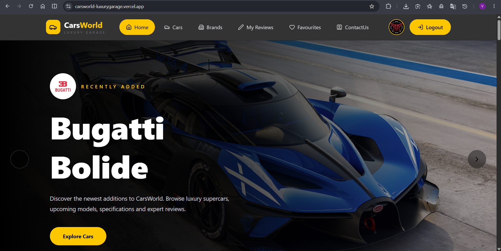
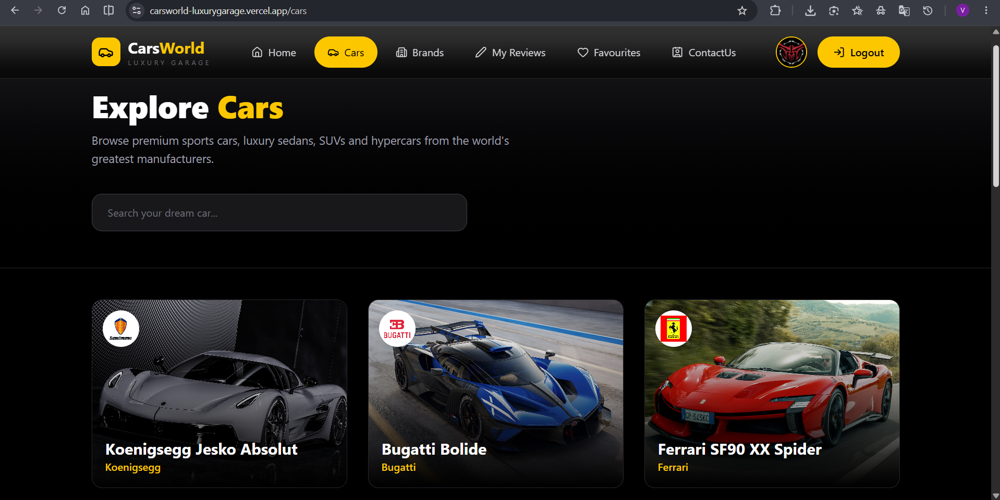
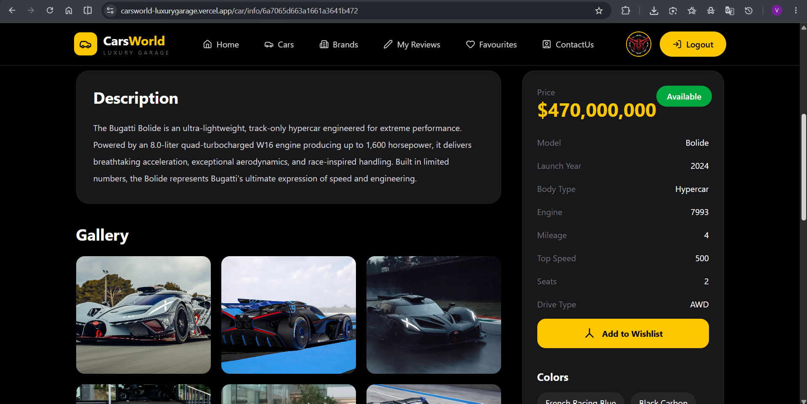
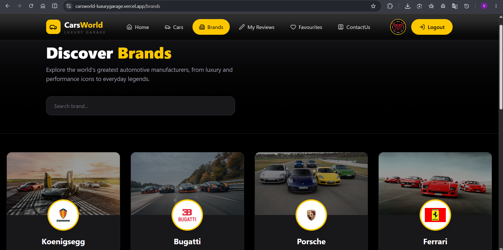
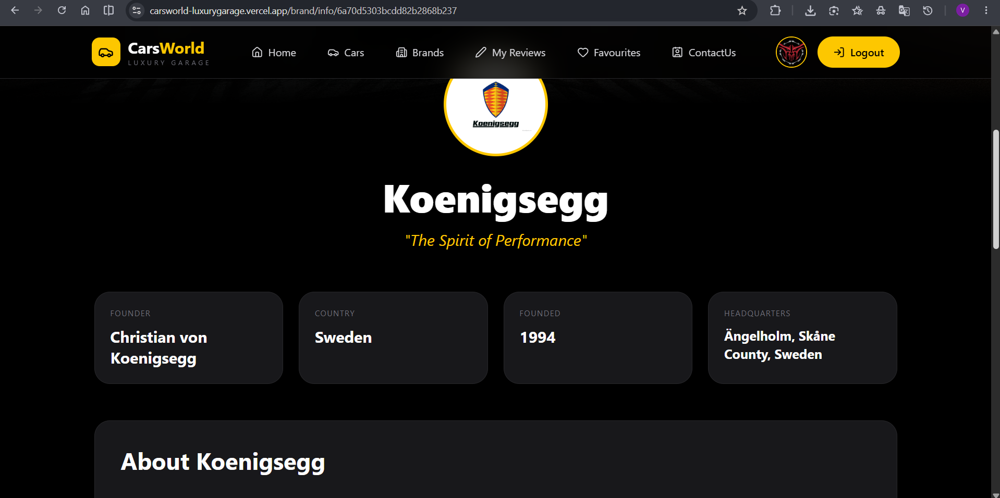
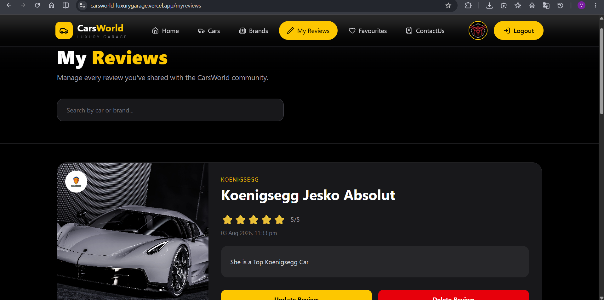
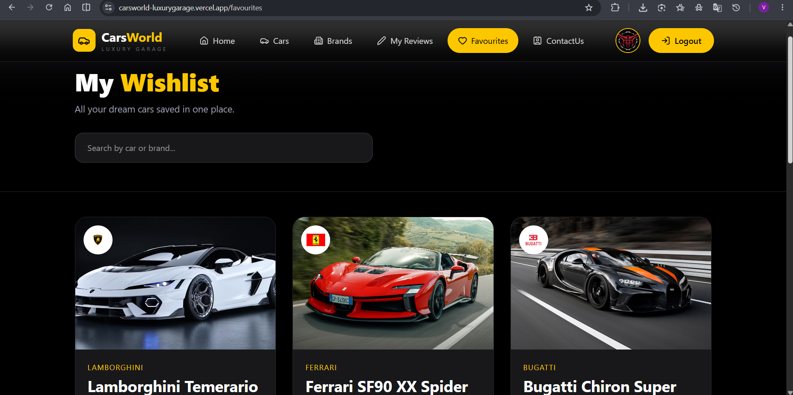
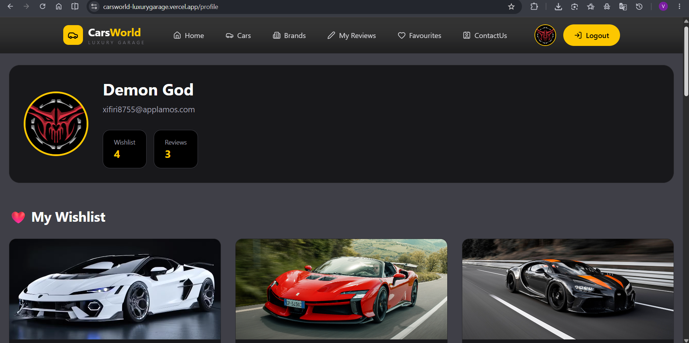
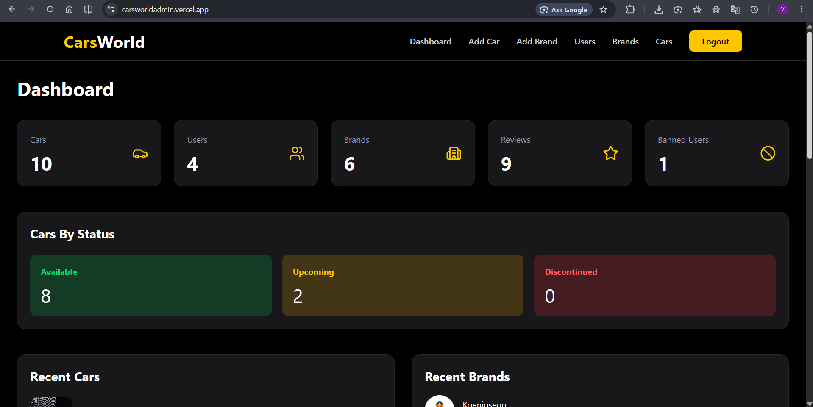
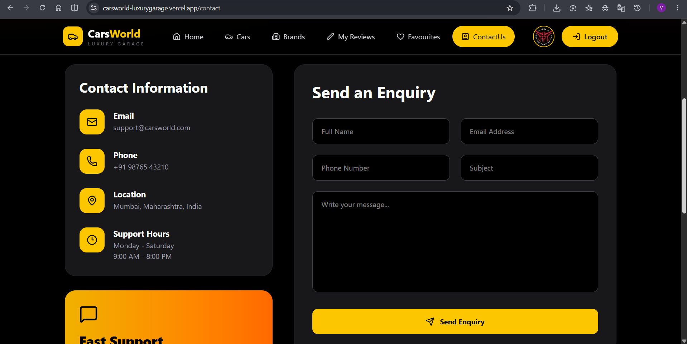

# 🚗 CarsWorld

CarsWorld is a modern full-stack MERN application built for automobile enthusiasts to explore luxury, sports, and hypercars from the world's leading manufacturers. Users can browse brands, discover detailed car specifications, manage wishlists, submit reviews, and stay updated with upcoming vehicle launches through a sleek, responsive interface.

## 🌐 Live Demo

* **🚘 CarsWorld Website:** https://carsworld-luxurygarage.vercel.app
* **🛠️ CarsWorld Admin Panel:** https://carsworldadmin.vercel.app/login

## ✨ Features

### User

* 🔐 Authentication (Signup, Login & Email Verification)
* 🔑 Forgot & Reset Password
* 🚗 Browse Luxury Cars
* 🏷️ Explore Car Brands
* ❤️ Wishlist Management
* ⭐ Car Reviews & Ratings
* 📅 Upcoming Car Launches
* 📱 Fully Responsive UI
* 📩 Contact & Inquiry Form

### Admin

* Dashboard Analytics
* Manage Brands
* Manage Cars
* Manage Reviews
* Manage Users
* Ban Users
* View Contact Inquiries

## 🛠️ Tech Stack

**Frontend**

* React.js
* Tailwind CSS
* React Router
* Axios

**Backend**

* Node.js
* Express.js
* MongoDB
* Mongoose
* JWT Authentication
* Multer
* Cloudinary
* Brevo Email API

## 🚀 Deployment

* **Frontend:** Vercel
* **Admin Panel:** Vercel
* **Backend:** Render
* **Database:** MongoDB Atlas

## 📸 Screenshots

### 🏠 Home Page

---

### 🚗 Cars Page

---

### 🚗 Car Details Page

---

### 🏷️ Brands Page

---

### 🏷️ Brand Details Page

---

### ❤️ User Reviews Page

---

### ❤️ User Wishlist Page

---

### ❤️ User Profile Page

---

### 🛠️ Admin Dashboard

---

### 📩 Contact Page

## 👨‍💻 Author

**Vijay Kusekar**

If you enjoyed this project, consider giving it a ⭐ on GitHub!
